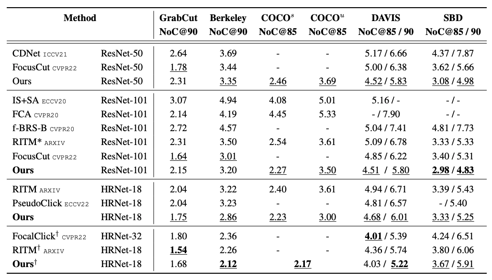

## Intention-aware Feature Propagation Network for Interactive Segmentation

Here is the evaluation code with trained models. Before start evaluation, you need to prepare data by downloading from the following link:

| Dataset   |                      Description             |           Download Link              |
|-----------|----------------------------------------------|:------------------------------------:|
|MS COCO    |  118k images with 1.2M instances (train)     |  [official site][GrabCut]            |
|COCO+LVIS* |  99k images with 1.5M instances (train)      |  [original LVIS images][LVIS] + <br> [our combined annotations][COCOLVIS_annotation] |
|SBD        |  8498 images with 20172 instances for (train)<br>2857 images with 6671 instances for (test) |[official site][SBD]|
|Grab Cut   |  50 images with one object each (test)       |  [GrabCut.zip (11 MB)][GrabCut]      |
|Berkeley   |  96 images with 100 instances (test)         |  [Berkeley.zip (7 MB)][Berkeley]     |
|DAVIS      |  345 images with one object each (test)      |  [DAVIS.zip (43 MB)][DAVIS]          |
|Pascal VOC |  1449 images with 3417 instances (validation)|  [official site][PascalVOC]          |
|COCO_MVal  |  800 images with 800 instances (test)        |  [COCO_MVal.zip (127 MB)][COCO_MVal] |

[MSCOCO]: https://cocodataset.org/#download
[LVIS]: https://www.lvisdataset.org/dataset
[SBD]: http://home.bharathh.info/pubs/codes/SBD/download.html
[GrabCut]: https://github.com/saic-vul/fbrs_interactive_segmentation/releases/download/v1.0/GrabCut.zip
[Berkeley]: https://github.com/saic-vul/fbrs_interactive_segmentation/releases/download/v1.0/Berkeley.zip
[DAVIS]: https://github.com/saic-vul/fbrs_interactive_segmentation/releases/download/v1.0/DAVIS.zip
[PascalVOC]: http://host.robots.ox.ac.uk/pascal/VOC/
[COCOLVIS_annotation]: https://github.com/saic-vul/ritm_interactive_segmentation/releases/download/v1.0/cocolvis_annotation.tar.gz
[COCO_MVal]: https://github.com/saic-vul/fbrs_interactive_segmentation/releases/download/v1.0/COCO_MVal.zip

After downloading the data, please change the paths to the datasets in ```config.yml```.

### Evaluation

```bash
python scripts/evaluate_model.py --intention ./models/coarse_level.pth --segmentation ./models/fine_level.pth  --datasets GrabCut,Berkeley
```

The model we provide is HRNet18 trained on COCO+LVIS, and its performance(NoC@90) on Berkeley is 2.25

### Performance


